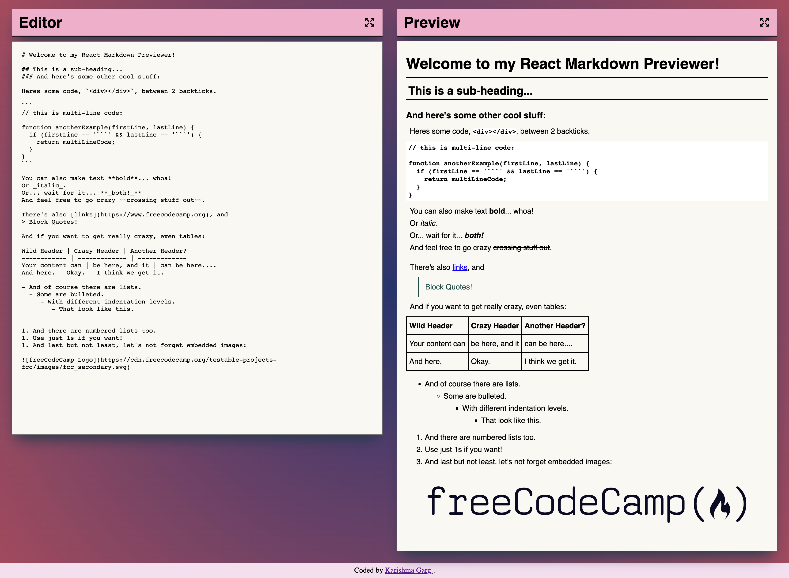

# Markdown Previewer

This is the second of the Front End Development Libraries Projects in Free Code Camp and the objective was to build a Markdown Previewer that meets Free Code Camp's user stories.

You can find a list of requirements and further information on the project [here](https://www.freecodecamp.org/learn/front-end-development-libraries/front-end-development-libraries-projects/build-a-markdown-previewer).

## Table of contents

- [Overview](#overview)
  - [The challenge](#the-challenge)
  - [Screenshot](#screenshot)
  - [Links](#links)
- [My process](#my-process)
  - [Built with](#built-with)
- [Author](#author)

## Overview

### The challenge

Users should be able to:

- Enter GitHub flavored markdown
- See the parsed markdown 
- Change the size of editor and previewer

### Screenshot

### Links

- Solution URL: [https://github.com/Krrish105/markdown-previewer](https://github.com/Krrish105/markdown-previewer)
- Live Site URL: [https://krrish105.github.io/markdown-previewer/](https://krrish105.github.io/markdown-previewer/)

## My process

### Built with

- Semantic HTML5 markup
- CSS custom properties
- CSS Grid
- Mobile-first workflow
- [React](https://reactjs.org/) - JS library

## Author

- Frontend Mentor - [Krrish105](https://www.frontendmentor.io/profile/Krrish105)
- Twitter - [_karishma10](https://twitter.com/_karishma10)
- Codepen - [Krrish105](https://codepen.io/krrish105)